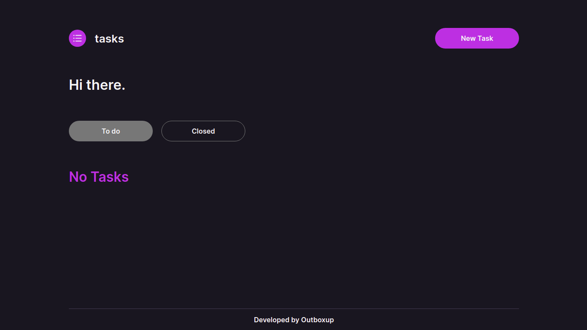
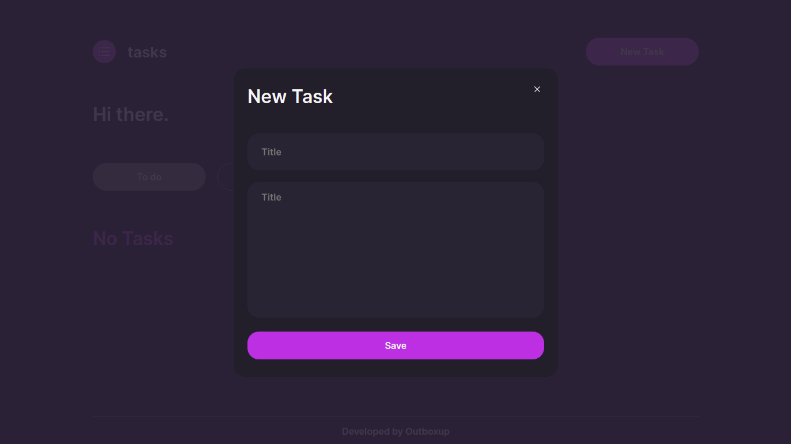
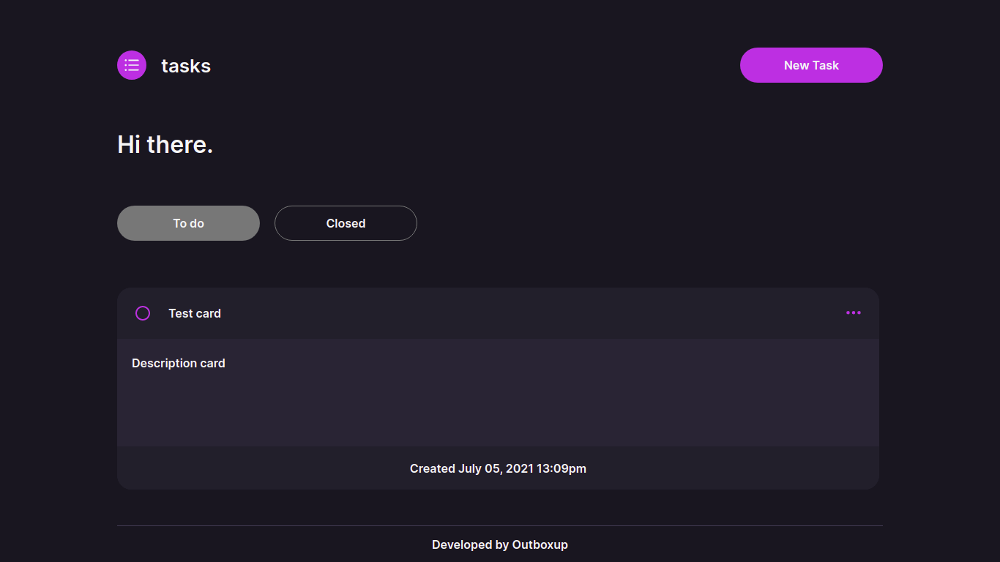

# Getting Started

### `yarn run`

This project was bootstrapped with yarn.

#

In the project directory, you can run:

### `yarn start`

Runs the app in the development mode.\
Open [http://localhost:3000](http://localhost:3000) to view it in the browser.

The page will reload if you make edits.\
You will also see any lint errors in the console.

### `Home page`

The first page.

Create task.

List of tasks.

